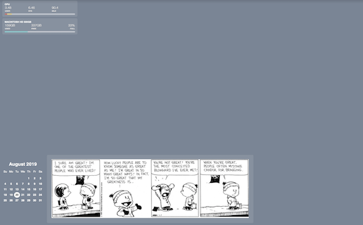

# calvin-hobbes.widget
A responsive widget made for [Übersicht](http://tracesof.net/uebersicht/) to show a random Calvin and Hobbes comic on your desktop.

## Screenshots

## Instructions
Download the **calvin-hobbes** folder and place it in Übersicht's widgets folder
Edit the index.coffee file and adjust the following properties to your liking:
- **refreshFrequency**: how often do you want to refresh the comic (in milliseconds)
- **bottom**, top: position the widget on your desktop
- **.ch-image**: resize the comic
